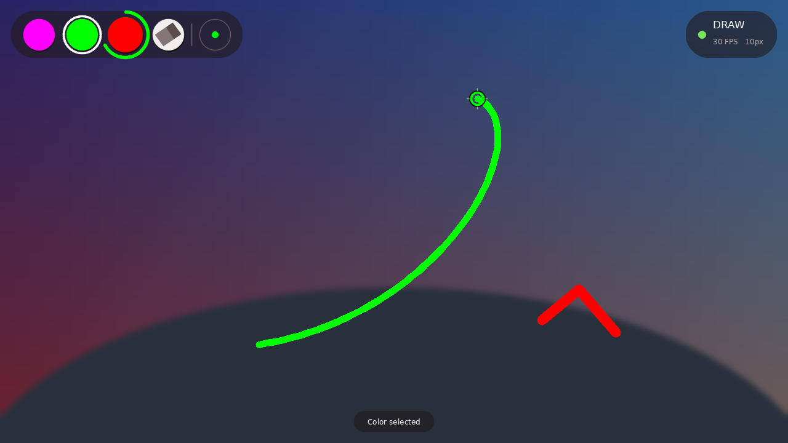

# Gesture-Based Air Drawing System 🎨✋

A real-time gesture-controlled air drawing application built using **Python**, **OpenCV**, and **MediaPipe**.

This project allows users to draw in the air using only hand gestures captured through a webcam — creating a touchless and interactive virtual drawing experience.

---

# 🖼️ Screenshot



*This is a rendered mockup of the current UI (frosted toolbar, dwell-select ring, live cursor, status pill, toast) built by driving the actual rendering code against a synthetic background — not a live webcam capture. The three photos in `screenshots/` below are real captures, but from an earlier version of the UI before the frosted-glass redesign; they're kept for history but no longer reflect the current look.*

---

# 🚀 Features

## ✋ Real-Time Hand Tracking

* Detects and tracks hand movements live through webcam input
* Uses 21 hand landmarks for precise finger positioning
* Smooth and responsive gesture interaction

---

## 🎨 Air Drawing System

* Draw in the air using your index finger
* Real-time stroke rendering
* Smooth continuous line generation

---

## 🤘 Pen Lift

* Raise your **pinky** alongside your index finger (middle finger stays down) to lift the pen — like a real pen off paper
* The cursor keeps tracking your fingertip, but nothing is drawn while lifted
* Put the pinky back down to start a brand-new stroke wherever your hand is — no line connects back to where you lifted
* Lets you reposition mid-drawing without fully closing your hand or switching to `SELECT` mode

---

## 🧠 Gesture Recognition

The **right hand** drives drawing. Different gestures activate different modes:

| Gesture                     | Action         |
| --------------------------- | -------------- |
| ☝️ Index Finger Up          | Draw Mode      |
| 🤘 Index + Pinky Up (middle down) | Lift Mode — reposition without drawing |
| ✌️ Index + Middle Finger Up | Selection Mode |
| ✊ Fist                      | Idle Mode      |

---

## 🤝 Two-Hand Gestures

With both hands in view, the **left hand** becomes a live control:

| Gesture                                        | Action                          |
| ----------------------------------------------- | -------------------------------- |
| 🤏 Left hand pinch (thumb + index)              | Resize the active brush/eraser, live |
| ✌️✌️ Both hands, index + middle up on each      | Frame a box between the two index tips and apply a live cartoon filter inside it |

The box-filter gesture takes priority — while both hands are making it, the left-hand pinch and right-hand draw/select are paused for that frame.

---

## 🖌️ Multiple Brush Colors

* Purple brush
* Green brush
* Red brush
* Gesture-controlled color selection

---

## 🧽 Eraser Tool

* Touchless erasing using gesture selection
* Larger eraser thickness for realistic editing

---

## 🖼️ Two-Hand Box Filter

* Frame any region of the live feed between your two index fingertips
* Applies a live cartoon/edge filter inside the frame while the gesture is held
* Your existing drawing still shows on top of the filtered background

---

## 📏 Brush Thickness Control

* Live, gesture-driven resizing: pinch your left hand's thumb and index finger closer together or farther apart to shrink or grow the active brush/eraser
* `+` / `-` keys still work as a manual fallback

---

## 🪄 Gesture Smoothing

* Reduces shaky lines
* Stabilizes hand movement
* Produces cleaner strokes

---

## 💾 Save Drawing Feature

Press:

```bash
S
```

to save your artwork instantly.

---

## 🧹 Clear Canvas

Press:

```bash
C
```

to clear the drawing canvas.

---

## ↩️ Undo / Redo

* `Z` undoes the last stroke; `Y` redoes it
* Clearing the canvas (`C`) is itself one undoable action — `Z` right after a clear brings everything back at once
* Drawing is tracked as a list of strokes (points + color + thickness), not raw pixels, so undo/redo replays that history instead of storing pixel snapshots

---

## ⚡ FPS Counter

Displays live performance metrics:

* Frames Per Second
* Real-time processing speed

---

## 🖥️ Interactive Toolbar UI

* Floating frosted-glass panels — the camera image behind each panel is blurred and tinted, rather than covered by a flat bar
* TrueType text rendered through Pillow (falls back gracefully across Windows/macOS/Linux font paths)
* Dwell-to-select with a progress ring, so tools aren't picked by accident
* Hover and selection animation, plus an active-tool ring
* Live brush-size gauge, mode indicator, and FPS readout
* On-screen toast notifications for save/clear/tool changes
* Resizable window, fullscreen toggle, and a UI that scales with the frame size

---

# 🛠️ Technologies Used

* Python
* OpenCV
* MediaPipe
* NumPy
* Pillow (TrueType text rendering)

---

# 📂 Project Structure

```bash
air-drawing-system/
│
├── main.py            # CLI + the frame loop: wires everything below together
├── gestures.py         # Pure hand-landmark helpers (finger state, pinch mapping)
├── filters.py           # Image effects (the box-filter cartoon effect)
├── canvas.py            # Stroke-based drawing surface with undo/redo
├── ui.py                 # Rendering: fonts, frosted panels, toolbar, HUD, toasts
├── requirements.txt
├── README.md
├── .gitignore
├── LICENSE
│
├── screenshots/
│   ├── ui_overview.png    # current UI (rendered mockup, see above)
│   ├── Draw Mode.png       # earlier UI, kept for history
│   ├── Idle Mode.png
│   ├── Select Mode.png
```

Each module has one job: `gestures.py` and `filters.py` have no dependency
on each other or on the app's state — they're plain functions over
landmarks/pixels. `canvas.py` owns drawing state and knows nothing about
rendering. `ui.py` only knows how to draw what it's handed; it doesn't
know what a gesture is. `main.py` is the only place that ties hand
tracking, canvas state, and rendering together into a frame loop.

---

# ⚙️ Installation

## 1. Clone Repository

```bash
git clone https://github.com/IbadUllahHasan/air_drawing_system
```

---

## 2. Open Project Folder

```bash
cd air_drawing_system
```

---

## 3. Install Dependencies

```bash
pip install -r requirements.txt
```

---

## 4. Run Project

```bash
python main.py
```

---

# 🎮 Controls

| Key   | Function                              |
| ----- | -------------------------------------- |
| `C`   | Clear Canvas                          |
| `Z`   | Undo                                  |
| `Y`   | Redo                                  |
| `S`   | Save Drawing (`drawing.png`)          |
| `H`   | Toggle hand-tracking overlay          |
| `F`   | Toggle fullscreen                     |
| `ESC` | Exit Program                          |
| `+`   | Increase Brush Size (manual fallback) |
| `-`   | Decrease Brush Size (manual fallback) |

Undo/redo use bare `Z`/`Y` rather than `Ctrl+Z`/`Ctrl+Y` — OpenCV's
`waitKey` doesn't reliably report modifier keys across platforms, so
every shortcut in this app is a single bare key.

## Command-line options

The window is freely resizable by dragging its edge, and you can set the
camera, capture resolution, and starting window size at launch:

```bash
python main.py --camera 1 --width 1920 --height 1080 --window 960x540
python main.py --fullscreen
```

| Flag         | Default    | Purpose                        |
| ------------ | ---------- | ------------------------------ |
| `--camera`   | `0`        | Camera device index            |
| `--width`    | `1280`     | Requested capture width        |
| `--height`   | `720`      | Requested capture height       |
| `--window`   | `1280x720` | Initial window size (`WxH`)    |
| `--fullscreen` | off      | Start in fullscreen            |

---

# 📖 How to Use

## 1. Get set up

* Sit facing your webcam in reasonably even lighting, with your hand(s) fully inside the frame.
* Run `python main.py`. A resizable window titled **"Air Drawing"** opens showing your mirrored camera feed with a floating toolbar. Drag the window edge to resize it, or press `F` for fullscreen.
* A hint bar along the bottom lists the shortcuts for the first few seconds.
* Press `ESC` any time to quit — the camera is always released cleanly on exit.

## 2. Draw with your right hand

| Do this                         | What happens                |
| -------------------------------- | ---------------------------- |
| Raise only your **index finger** | `DRAW` mode — a colored line follows your fingertip |
| Raise **index + pinky** (🤘, middle down) | `LIFT` mode — cursor moves freely, nothing is drawn |
| Raise **index + middle** finger  | `SELECT` mode — move over the toolbar to pick a tool, nothing is drawn |
| Close your hand / drop your fingers | `IDLE` mode — tracking pauses, no drawing |

The current mode and live FPS are shown in the top-right of the window. Each mode has its own color there and on the cursor, so `LIFT` is visually distinct from `DRAW` at a glance.

## 3. Pick a color or the eraser

While in `SELECT` mode (index + middle up), hold your fingertip over a toolbar swatch. A ring fills around it as you hover — once it completes (about half a second), the tool is selected and a toast confirms it. This **dwell-to-select** delay is deliberate: it stops you from grabbing a tool by accident while moving your hand across the toolbar.

* **Magenta / Green / Red** circles — switch the draw brush to that color
* **Eraser** circle — switch to the eraser (uses a separate, larger thickness so it doesn't affect your draw brush size)

The active tool is marked with a white ring, and the gauge on the right of the toolbar shows your current brush size against its maximum.

## 4. Resize the brush with your left hand

Bring your **left hand** into frame and pinch your thumb and index finger together or apart:

* Pinched tight → thinnest brush/eraser
* Spread wide → thickest brush/eraser

This adjusts whichever tool is currently active (draw brush or eraser) and updates live as you draw with your right hand. The `+`/`-` keys do the same thing manually if you'd rather not use two hands.

## 5. Apply the two-hand box filter

Raise **index + middle finger on both hands at once**. A rectangle is drawn between your two index fingertips and a live cartoon/edge filter is applied inside it — move your hands to move and resize the filtered region. Drop either hand's pose to turn it off. Anything already drawn stays visible on top of the filtered area.

## 6. Undo, redo, save, or clear your work

* Press `Z` to undo the last stroke, `Y` to redo it.
* Press `C` to clear the canvas — this is itself undoable, so `Z` immediately after brings everything back.
* Press `S` to save the current canvas to `drawing.png` in the project folder.

---

# 🧠 How It Works

The webcam continuously captures video frames, which are:

1. Flipped horizontally for a natural mirror view
2. Passed to MediaPipe Hands (tracking up to two hands, 21 landmarks each)
3. Classified as the **right hand** (drawing/toolbar) or **left hand** (pinch-resize), with a two-hand pose reserved for the box filter
4. Converted into drawing actions based on which fingers are raised and where the fingertip is

A separate digital canvas stores all drawing strokes and is composited over the live webcam feed every frame, so strokes persist even as the camera view keeps changing.

---

# 🌍 Real-World Applications

* Smart classrooms
* Virtual whiteboards
* Touchless interfaces
* Accessibility systems
* Gesture-controlled presentations
* AR/VR interaction systems

---

# 🔮 Future Improvements

* Shape recognition (snap freehand strokes to clean circles/rectangles/lines)
* Virtual mouse control
* More box-filter effects (grayscale, thermal colormap, invert) with a way to cycle between them
* Automated tests for the pure logic in `gestures.py` and `canvas.py`, plus CI

---

# 📈 What This Project Demonstrates

This project showcases:

* Computer Vision
* Real-Time Video Processing
* Human Computer Interaction (HCI)
* Gesture Recognition
* Interactive UI Systems
* Coordinate Mapping
* AI-assisted interaction concepts

---

# 📜 License

This project is licensed under the MIT License.

---

# ⭐ Final Note

This project started as a simple hand tracking experiment and evolved into a complete gesture-based interaction system.

The biggest learning came not from tutorials, but from:

* debugging
* experimenting
* modifying features
* solving real implementation problems

